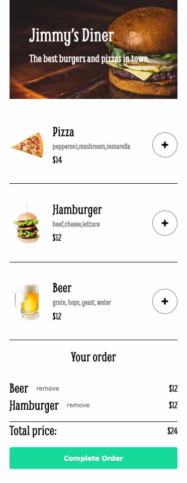

# Scrimba - SoloProject Restaurant Ordering App

This is a solution to the Module 5 - Solo Project: Restaurant Ordering App.

## Table of contents

- [Overview](#overview)
  - [Screenshot](#screenshot)
  - [Links](#links)
- [My process](#my-process)
  - [What I learned](#what-i-learned)
  - [Stretch Goals](#stretch-goals)
- [Author](#author)

## Overview

### Screenshot

### Links

- Solution URL: [GitHub](https://github.com/graficdoctor/soloproject-restaurant-ordering-app)
- Live Site URL: [Netlify](https://coruscating-cat-97e1c6.netlify.app/)

## My process

### What I learned
I mainly learned working with `.forEach()` and `.filter()`. It's the first time I used `.splice()` in a working app.

→ code refactoring: there are some errors in the html/css that need to be cleaned up. Also the JS can be written more concise.

### Stretch Goals

→ change the theme

→ offer a 'meal deal' discount

→ allow users to rate their experience

## Author

- Website - [Katrien S](https://www.katriens.be)
